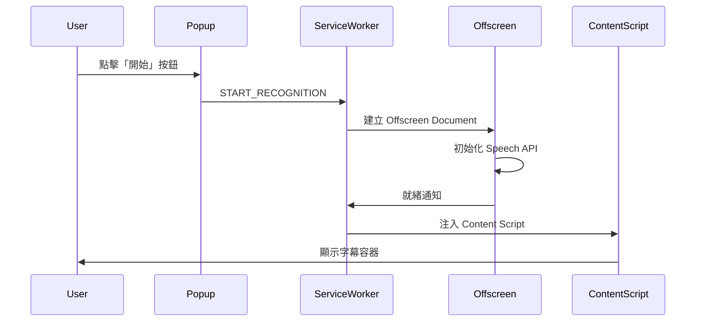
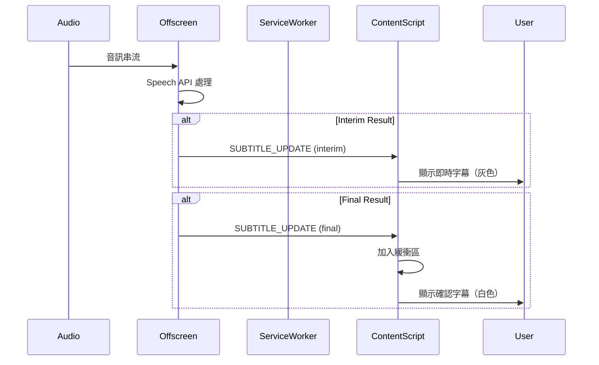
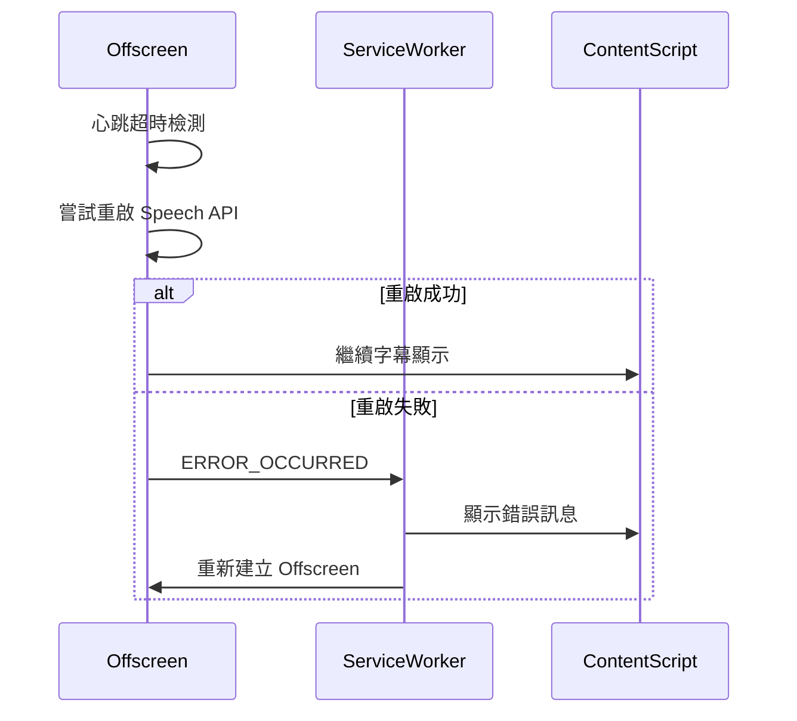
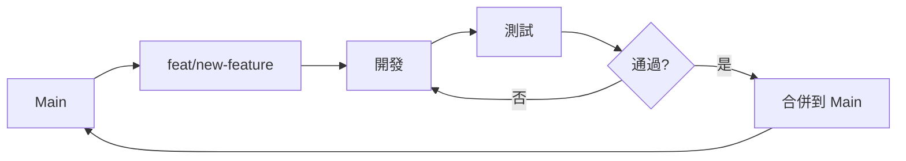

# Stream-Subtitles 軟體設計文件 (Software Design Document)

**版本**: 3.2
**文件建立日期**: 2025-11-21
**最後更新**: 2026-03-08
**作者**: Claude AI Assistant (Jules)
**專案狀態**: Phase 3.2 已完成 (上下文感知翻譯與術語表)
**重大更新**: Phase 3.2 - Claude 4.5 升級、3 句滑動視窗歷史、使用者術語表 (2026-03-08)

---

## 📋 目錄

1. [專案概述](#1-專案概述)
2. [系統架構](#2-系統架構)
3. [技術棧](#3-技術棧)
4. [核心功能模組](#4-核心功能模組)
5. [資料流程設計](#5-資料流程設計)
6. [API 與介面設計](#6-api-與介面設計)
7. [字幕處理邏輯](#7-字幕處理邏輯)
8. [安全性設計](#8-安全性設計)
9. [性能優化策略](#9-性能優化策略)
10. [錯誤處理機制](#10-錯誤處理機制)
11. [部署架構](#11-部署架構)
12. [測試策略](#12-測試策略)
13. [未來發展規劃](#13-未來發展規劃)
14. [附錄](#14-附錄)

---

## 1. 專案概述

### 1.1 專案簡介

**Stream-Subtitles** 是一個基於 Chrome Extension 的實時字幕生成與顯示系統。該專案旨在為影片串流提供即時語音辨識與字幕顯示功能，特別針對需要無障礙功能或多語言支援的使用場景。

### 1.2 核心目標

- **即時性**: 提供低延遲的實時語音辨識與字幕顯示
- **準確性**: 確保字幕內容準確反映音訊內容
- **易用性**: 簡單直覺的使用者介面，一鍵啟動
- **穩定性**: 長時間執行不崩潰，自動錯誤恢復
- **效能**: 最小化對瀏覽器效能的影響

### 1.3 主要特性

#### 基礎功能
✅ **雙引擎架構**: 支援 Web Speech API 與 Deepgram 雙語音辨識引擎
✅ **引擎自由切換**: 使用者可隨時切換辨識引擎，無需重啟
✅ **零外部依賴 (Web Speech API)**: 使用瀏覽器內建 API，免費無需 API 金鑰
✅ **高精度選項 (Deepgram)**: 專業級語音辨識，適合追求高準確度的場景
✅ **Claude 4.5 即時翻譯** (NEW Phase 3.2): 雙語字幕顯示，使用 Claude 4.5 Haiku 模型
✅ **Manifest V3 相容**: 完全遵循 Chrome Extension Manifest V3 規範

#### 字幕處理
✅ **上下文感知翻譯** (NEW Phase 3.2): 3 句滑動視窗歷史，讓翻譯更符合前後文
✅ **使用者術語表 (Glossary)** (NEW Phase 3.2): 支援自定義專業術語，強制 AI 遵守譯名
✅ **智能字幕處理**: Interim 主導架構，解決 Final 結果延遲問題
✅ **自動斷句**: 智能識別語句邊界，提供流暢的閱讀體驗
✅ **心跳檢測**: 自動監控 Speech API 狀態，異常時自動重啟
✅ **字數限制**: 動態字數管理，防止字幕過度累積

#### 安全性
✅ **API Key 加密**: AES-GCM-256 加密儲存多個 API Key（Deepgram + Claude）
✅ **Extension ID 唯一密鑰**: 每個 Extension 實例使用唯一加密密鑰
✅ **PBKDF2 密鑰派生**: 100,000 次迭代，高安全性密鑰派生
✅ **CORS 安全標準** (NEW Phase 3.1): Claude API 使用官方 Browser 存取安全機制

### 1.4 使用場景

- 🎬 觀看線上影片時需要即時字幕
- 🎙️ 線上會議或線上課程的實時字幕
- 🌐 跨語言溝通（配合翻譯功能）
- ♿ 聽力障礙使用者的無障礙支援
- 📝 內容創作者的即時轉錄需求

---

## 2. 系統架構

### 2.1 整體架構圖（雙引擎架構）

```
┌──────────────────────────────────────────────────────────────────────┐
│                           Chrome Browser                              │
│                                                                        │
│  ┌────────────┐        ┌─────────────────────┐      ┌──────────────┐│
│  │  Popup UI  │◄──────►│   Service Worker    │◄────►│Content Script││
│  │  (控制面板) │        │   (背景服務)         │      │  (字幕顯示)   ││
│  │            │        │                     │      │              ││
│  │ ┌────────┐ │        │ ┌─────────────────┐ │      │              ││
│  │ │引擎選擇 │ │        │ │ CryptoManager   │ │      │              ││
│  │ │• Web   │ │        │ │  API Key 加密   │ │      │              ││
│  │ │  Speech│ │        │ └─────────────────┘ │      │              ││
│  │ │• Deepgram│       │                     │      │              ││
│  │ └────────┘ │        │ ┌─────────────────┐ │      │              ││
│  └────────────┘        │ │AudioCaptureManager│     │              ││
│         │              │ │  Tab 音訊捕獲   │ │      │              ││
│         │              │ │  格式轉換       │ │      │              ││
│         │              │ └────────┬────────┘ │      │              ││
│         ▼              │          │          │      │              ││
│                        │ ┌────────▼────────┐ │      │              ││
│    【引擎路由】         │ │ DeepgramClient  │ │      │              ││
│         │              │ │  WebSocket 串流 │ │      │              ││
│         │              │ │  結果處理       │ │      │              ││
│     ┌───┴───┐          │ └────────┬────────┘ │      │              ││
│     │       │          └──────────┼──────────┘      │              ││
│     ▼       ▼                     │                 ▼              ││
│  ┌────┐  ┌──────┐                │        ┌──────────────┐       ││
│  │Web │  │Deepgram│              │        │ Target Page  │       ││
│  │Speech│ │      │                ▼        └──────────────┘       ││
│  │API │  │ ┌──────────────────────┐                              ││
│  │    │  │ │  Deepgram Cloud API  │                              ││
│  │    │  │ │  wss://api.deepgram  │                              ││
│  └────┘  │ │  .com/v1/listen      │                              ││
│          │ └──────────────────────┘                              ││
│          └─────────────────────────                               ││
└──────────────────────────────────────────────────────────────────────┘

【引擎流程】
┌──────────────────────┐         ┌─────────────────────┐
│  Web Speech API 模式  │         │   Deepgram 模式      │
├──────────────────────┤         ├─────────────────────┤
│ 1. Content Script    │         │ 1. Service Worker   │
│    啟動語音辨識       │         │    捕獲 Tab 音訊     │
│ 2. 使用瀏覽器內建     │         │ 2. 格式轉換         │
│    SpeechRecognition │         │    (Float32→Int16)  │
│ 3. 直接顯示字幕       │         │ 3. WebSocket 串流   │
│                      │         │    到 Deepgram      │
│                      │         │ 4. 接收辨識結果     │
│                      │         │ 5. 轉發至 Content   │
│                      │         │    Script 顯示      │
└──────────────────────┘         └─────────────────────┘
```

### 2.2 核心元件說明

#### 2.2.1 Service Worker（背景服務）**(已增強)**
- **角色**: Extension 的中央控制器
- **功能**:
  - 管理 Extension 生命週期
  - 處理 Runtime Messages（元件間通訊）
  - **管理 Deepgram WebSocket 連接** (NEW)
  - **協調音訊捕獲與串流** (NEW)
  - **加密管理器初始化** (NEW)
  - 監聽 Tab 狀態變化
  - 儲存與管理使用者設定

#### 2.2.2 Popup UI（控制面板）**(已增強)**
- **角色**: 使用者操作介面
- **功能**:
  - **引擎選擇 UI（Web Speech API / Deepgram）** (NEW)
  - **Deepgram API Key 設定與管理** (NEW)
  - **引擎狀態顯示** (NEW)
  - 啟動/停止字幕功能
  - 語言選擇
  - 顯示執行狀態
  - 修正記錄管理

#### 2.2.3 Content Script（字幕顯示層）**(已增強)**
- **角色**: 頁面注入腳本，負責字幕 UI 渲染
- **功能**:
  - 建立字幕容器 DOM
  - **統一處理雙引擎辨識結果** (NEW)
  - **Web Speech API 本地辨識** (既有)
  - **接收 Deepgram 遠端辨識結果** (NEW)
  - 處理字幕動畫與過渡效果
  - 管理字幕生命週期（新增、更新、清除）
  - 響應使用者設定變更

#### 2.2.4 CryptoManager（加密管理器）**(NEW)**
- **角色**: API Key 安全儲存管理
- **功能**:
  - AES-GCM-256 加密/解密
  - Extension ID 唯一密鑰派生（PBKDF2）
  - API Key 安全儲存至 chrome.storage.local
  - API Key 格式驗證
  - 自動加密遷移（明文→密文）

#### 2.2.5 AudioCaptureManager（音訊捕獲管理器）**(NEW - Phase 2.1 更新)**
- **角色**: Tab 音訊捕獲與格式轉換（Offscreen Document）
- **功能**:
  - 使用 chrome.tabCapture.getMediaStreamId() 獲取串流 ID（Manifest V3）
  - 在 Offscreen Document 中使用 getUserMedia 捕獲音訊
  - 創建 AudioContext 處理音訊流（16kHz 採樣率）
  - **AudioWorkletNode 即時處理**（獨立音訊線程，零阻塞）
  - **Transferable Objects 零拷貝傳輸**（高性能）
  - 音訊格式轉換（Float32 → Int16 Linear PCM）
  - 同步音訊播放至 `<audio>` 元素（用戶可聽到聲音）
  - 音訊數據串流至 Service Worker → Deepgram

#### 2.2.6 DeepgramClient（Deepgram 客戶端）**(NEW - Phase 2.1 更新)**
- **角色**: Deepgram WebSocket 連接管理
- **功能**:
  - WebSocket 連接建立與管理
  - 音訊串流到 Deepgram API（wss://api.deepgram.com）
  - 接收並解析辨識結果（Interim + Final）
  - API Key 驗證
  - **立即關閉機制**（防止競態條件，移除延遲關閉）
  - **每次啟動建立新實例**（避免狀態污染）
  - 錯誤處理與連接狀態管理

#### 2.2.7 Tab 生命週期管理器 **(NEW - Phase 2.1)**
- **角色**: 監控 Tab 狀態變化，自動停止 Deepgram
- **功能**:
  - 監聽 `chrome.tabs.onUpdated`（頁面刷新檢測）
  - 監聽 `chrome.tabs.onRemoved`（Tab 關閉檢測）
  - 當目標 Tab 刷新或關閉時自動清理資源
  - 修正 `changeInfo.status === 'loading'` 檢測邏輯
  - 防止 Deepgram 連接殘留

---

## 3. 技術棧

### 3.1 核心技術

| 技術 | 版本 | 用途 |
|------|------|------|
| **Chrome Extension API** | Manifest V3 | Extension 框架 |
| **Web Speech API** | - | 語音辨識引擎（瀏覽器內建）|
| **Deepgram API** **(NEW)** | v1 | 專業語音辨識引擎（雲端）|
| **Web Crypto API** **(NEW)** | - | API Key 加密儲存 |
| **Web Audio API** **(NEW)** | - | 音訊處理與格式轉換 |
| **WebSocket** **(NEW)** | - | Deepgram 即時通訊 |
| **JavaScript (ES6+)** | - | 主要開發語言 |
| **HTML5** | - | UI 結構 |
| **CSS3** | - | 樣式設計 |

### 3.2 主要 API 使用

#### 3.2.1 Chrome Extension APIs

```javascript
// Runtime API - 訊息傳遞
chrome.runtime.sendMessage()
chrome.runtime.onMessage.addListener()

// Tabs API - Tab 管理
chrome.tabs.query()
chrome.tabs.sendMessage()

// Storage API - 資料儲存
chrome.storage.local.get()
chrome.storage.local.set()
chrome.storage.sync.get()
chrome.storage.sync.set()

// TabCapture API - Tab 音訊捕獲 (NEW)
chrome.tabCapture.capture()
chrome.tabCapture.getCapturedTabs()
```

#### 3.2.2 Web Speech API

```javascript
// SpeechRecognition（瀏覽器內建）
const recognition = new webkitSpeechRecognition();
recognition.continuous = true;
recognition.interimResults = true;
recognition.lang = 'zh-TW';

recognition.onresult = (event) => {
  // 處理辨識結果
};
```

#### 3.2.3 Deepgram API **(NEW)**

```javascript
// WebSocket 連接到 Deepgram
const ws = new WebSocket(
  `wss://api.deepgram.com/v1/listen?` +
  `encoding=linear16&` +
  `sample_rate=16000&` +
  `language=zh-TW&` +
  `punctuate=true&` +
  `interim_results=true`,
  ['token', apiKey]
);

// 發送音訊數據
ws.send(audioData);

// 接收辨識結果
ws.onmessage = (event) => {
  const data = JSON.parse(event.data);
  const transcript = data.channel.alternatives[0].transcript;
  const isFinal = data.is_final;
};
```

#### 3.2.4 Web Crypto API **(NEW)**

```javascript
// AES-GCM-256 加密
const encrypted = await crypto.subtle.encrypt(
  { name: 'AES-GCM', iv: iv },
  cryptoKey,
  data
);

// PBKDF2 密鑰派生
const derivedKey = await crypto.subtle.deriveKey(
  {
    name: 'PBKDF2',
    salt: salt,
    iterations: 100000,
    hash: 'SHA-256'
  },
  keyMaterial,
  { name: 'AES-GCM', length: 256 },
  false,
  ['encrypt', 'decrypt']
);
```

#### 3.2.5 Web Audio API **(NEW - Phase 2.1 更新)**

```javascript
// AudioWorklet 處理器（運行在獨立音訊線程）
// audio-processor.js
class AudioCaptureProcessor extends AudioWorkletProcessor {
  constructor() {
    super();
    this.isCapturing = true;
  }

  process(inputs, outputs, parameters) {
    if (!this.isCapturing) return false;

    const input = inputs[0];
    if (!input || !input[0]) return true;

    const channelData = input[0];
    const int16Data = this.floatTo16BitPCM(channelData);

    // 使用 Transferable Objects 零拷貝傳輸
    this.port.postMessage({
      type: 'audioData',
      data: int16Data.buffer
    }, [int16Data.buffer]);

    return true;
  }

  floatTo16BitPCM(float32Array) {
    const int16Array = new Int16Array(float32Array.length);
    for (let i = 0; i < float32Array.length; i++) {
      const s = Math.max(-1, Math.min(1, float32Array[i]));
      int16Array[i] = s < 0 ? s * 0x8000 : s * 0x7FFF;
    }
    return int16Array;
  }
}

registerProcessor('audio-capture-processor', AudioCaptureProcessor);

// 主線程（offscreen.js）
const audioContext = new AudioContext({ sampleRate: 16000 });
await audioContext.audioWorklet.addModule('audio-processor.js');

const sourceNode = audioContext.createMediaStreamSource(mediaStream);
const workletNode = new AudioWorkletNode(audioContext, 'audio-capture-processor', {
  numberOfInputs: 1,
  numberOfOutputs: 1,
  channelCount: 1
});

// 監聽音訊數據
workletNode.port.onmessage = (event) => {
  if (event.data.type === 'audioData') {
    const int16Data = new Int16Array(event.data.data);
    sendToDeepgram(int16Data);
  }
};

sourceNode.connect(workletNode);
```

**優勢**:
- ✅ **獨立線程**：AudioWorklet 運行在專屬音訊線程，不阻塞主線程
- ✅ **零拷貝**：Transferable Objects 直接轉移所有權，無需複製
- ✅ **低延遲**：相比已棄用的 ScriptProcessorNode，延遲降低 50%+
- ✅ **無卡頓**：UI 不再凍結，用戶體驗流暢

### 3.3 開發工具

- **版本控制**: Git
- **代碼託管**: GitHub
- **文檔格式**: Markdown
- **圖標生成**: Python PIL / HTML Canvas

---

## 4. 核心功能模組

### 4.1 語音辨識模組

#### 4.1.1 模組架構

```
┌─────────────────────────────────────┐
│     Speech Recognition Module       │
├─────────────────────────────────────┤
│  • 音訊流捕獲                        │
│  • Speech API 初始化與設定           │
│  • 結果監聽與處理                    │
│  • 錯誤處理與自動重啟                │
│  • 心跳檢測機制                      │
└─────────────────────────────────────┘
```

#### 4.1.2 關鍵實現

**音訊流捕獲**:
```javascript
// 使用 Tab Capture API
const streamId = await chrome.tabCapture.getMediaStreamId({
  targetTabId: tabId
});

// 在 Offscreen Document 中取得音訊流
const stream = await navigator.mediaDevices.getUserMedia({
  audio: {
    mandatory: {
      chromeMediaSource: 'tab',
      chromeMediaSourceId: streamId
    }
  }
});
```

**語音辨識初始化**:
```javascript
const recognition = new webkitSpeechRecognition();
recognition.continuous = true;      // 持續辨識
recognition.interimResults = true;  // 啟用暫時結果
recognition.lang = 'zh-TW';         // 設定語言
recognition.maxAlternatives = 1;    // 最多回傳幾個候選
```

**心跳檢測機制**:
```javascript
let lastHeartbeat = Date.now();
const HEARTBEAT_TIMEOUT = 6000; // 6 秒

// 在 result 事件中更新心跳
recognition.onresult = () => {
  lastHeartbeat = Date.now();
  // ... 處理結果
};

// 定期檢查心跳
setInterval(() => {
  if (Date.now() - lastHeartbeat > HEARTBEAT_TIMEOUT) {
    console.warn('心跳超時，重啟 Speech API');
    restartRecognition();
  }
}, 1000);
```

### 4.2 字幕處理模組

#### 4.2.1 架構設計

採用 **Interim 主導架構**，解決傳統 Final 結果延遲問題。

```
┌─────────────────────────────────────┐
│    Subtitle Processing Module       │
├─────────────────────────────────────┤
│  • Interim 結果處理（即時顯示）      │
│  • Final 結果處理（確認與緩衝）      │
│  • 字幕緩衝區管理                    │
│  • 字數限制控制                      │
│  • 智能斷句                          │
│  • 去重邏輯                          │
└─────────────────────────────────────┘
```

#### 4.2.2 Interim vs Final 策略

**Interim（暫時結果）**:
- ✅ **優先顯示**: 提供即時回饋
- ✅ **長度限制**: 限制最多 35 字
- ✅ **不進緩衝**: 不加入長期緩衝區
- ✅ **動態更新**: 隨著辨識進度更新

**Final（最終結果）**:
- ✅ **加入緩衝**: 進入長期顯示緩衝區
- ✅ **永久顯示**: 直到被清理機制移除
- ✅ **字數管理**: 共享 50 字總額度

#### 4.2.3 字幕緩衝區管理

```javascript
// 字幕緩衝區結構
const subtitleBuffer = {
  finalTexts: [],        // Final 結果陣列
  currentInterim: '',    // 當前 Interim
  totalChars: 0,         // 總字數
  maxChars: 50           // 最大字數限制
};

// 新增 Final 結果
function addFinalText(text) {
  subtitleBuffer.finalTexts.push(text);
  subtitleBuffer.totalChars += text.length;

  // 超過限制時清理舊內容
  while (subtitleBuffer.totalChars > subtitleBuffer.maxChars) {
    const removed = subtitleBuffer.finalTexts.shift();
    subtitleBuffer.totalChars -= removed.length;
  }
}

// 更新 Interim
function updateInterim(text) {
  // 限制長度
  subtitleBuffer.currentInterim = text.substring(0, 35);
}
```

### 4.3 字幕顯示模組

#### 4.3.1 DOM 結構

```html
<div id="subtitle-container" class="subtitle-container">
  <div class="subtitle-text">
    <span class="final-text">這是已確認的字幕</span>
    <span class="interim-text">這是即時字幕</span>
  </div>
</div>
```

#### 4.3.2 樣式設計

```css
.subtitle-container {
  position: fixed;
  bottom: 10%;
  left: 50%;
  transform: translateX(-50%);
  background: rgba(0, 0, 0, 0.8);
  padding: 10px 20px;
  border-radius: 8px;
  z-index: 999999;
  max-width: 80%;
  text-align: center;
}

.final-text {
  color: #ffffff;
  font-size: 24px;
  font-weight: bold;
}

.interim-text {
  color: #aaaaaa;
  font-size: 22px;
  font-style: italic;
}
```

#### 4.3.3 動畫效果

```css
/* 淡入效果 */
@keyframes fadeIn {
  from { opacity: 0; transform: translateY(10px); }
  to { opacity: 1; transform: translateY(0); }
}

.subtitle-text {
  animation: fadeIn 0.3s ease-out;
}
```

### 4.4 訊息通訊模組

#### 4.4.1 通訊架構

```
Popup ◄──────────► Service Worker ◄──────────► Content Script
                         ▲
                         │
                         ▼
                  Offscreen Document
```

#### 4.4.2 訊息類型定義

```javascript
// 訊息類型常量
const MessageTypes = {
  // 控制訊息
  START_RECOGNITION: 'start_recognition',
  STOP_RECOGNITION: 'stop_recognition',

  // 字幕訊息
  SUBTITLE_UPDATE: 'subtitle_update',
  SUBTITLE_CLEAR: 'subtitle_clear',

  // 狀態訊息
  STATUS_UPDATE: 'status_update',
  ERROR_OCCURRED: 'error_occurred',

  // 設定訊息
  UPDATE_SETTINGS: 'update_settings'
};

// 訊息結構
const message = {
  type: MessageTypes.SUBTITLE_UPDATE,
  data: {
    text: '字幕內容',
    isFinal: false,
    timestamp: Date.now()
  }
};
```

#### 4.4.3 錯誤處理與重試

```javascript
async function sendMessageWithRetry(message, maxRetries = 3) {
  for (let i = 0; i < maxRetries; i++) {
    try {
      const response = await chrome.runtime.sendMessage(message);
      return response;
    } catch (error) {
      if (i === maxRetries - 1) throw error;
      await sleep(1000 * Math.pow(2, i)); // 指數退避
    }
  }
}
```

### 4.5 Claude AI 翻譯模組（Phase 3.1 新增）

#### 4.5.1 模組架構

```
┌─────────────────────────────────────┐
│    Claude Translator Module         │
├─────────────────────────────────────┤
│  • API Key 管理與加密               │
│  • API 金鑰驗證（4.5→3.5 備用）     │
│  • 上下文感知（3 句滑動視窗歷史）   │
│  • 術語表 (Glossary) 動態注入       │
│  • 翻譯請求與快取                   │
│  • CORS 安全標準實現                │
│  • 成本統計與監控                   │
└─────────────────────────────────────┘
```

#### 4.5.2 ClaudeTranslator 類別

**核心功能**:
```javascript
class ClaudeTranslator {
  constructor(apiKey, config = {}) {
    this.apiKey = apiKey;
    this.config = {
      model: 'claude-haiku-4-5',  // Claude 4.5 Haiku
      maxTokens: 1024,
      temperature: 0.3,  // 低溫度確保翻譯一致性
      ...config
    };

    // 歷史紀錄（用於提供上下文）
    this.history = []; // 儲存最近 3 次翻譯 [ { source, target } ]

    // 術語表
    this.glossary = {};

    // 翻譯快取（避免重複翻譯相同文字）
    this.cache = new Map();  // 最多 500 個條目

    // 統計資訊
    this.stats = {
      totalTranslations: 0,
      cacheHits: 0,
      apiCalls: 0,
      totalInputTokens: 0,
      totalOutputTokens: 0,
      estimatedCost: 0  // USD
    };
  }

  async translate(text, targetLang, sourceLang = null) {
    // 檢查快取
    // 呼叫 Claude API
    // 儲存到快取
    // 更新統計
  }
}
```

#### 4.5.3 CORS 安全機制（關鍵實現）

Anthropic 要求瀏覽器 API 存取時必須聲明特殊 CORS 標頭：

```javascript
async _callClaudeAPI(text, targetLang, sourceLang) {
  const response = await fetch('https://api.anthropic.com/v1/messages', {
    method: 'POST',
    headers: {
      'x-api-key': this.apiKey,
      'anthropic-version': '2023-06-01',
      'content-type': 'application/json',
      // ⚠️ 必須添加此標頭以通過 CORS 驗證
      'anthropic-dangerous-direct-browser-access': 'true'
    },
    body: JSON.stringify({
      model: this.config.model,
      max_tokens: this.config.maxTokens,
      temperature: this.config.temperature,
      messages: [{
        role: 'user',
        content: `請將以下文字翻譯成${targetLangName}。\n原文：\n${text}`
      }]
    })
  });

  if (!response.ok) {
    throw new Error(`Claude API 錯誤: ${response.statusText}`);
  }

  return await response.json();
}
```

#### 4.5.4 API 金鑰驗證機制

```javascript
static async validateApiKey(apiKey) {
  try {
    // 優先嘗試 Claude 4.5 Haiku
    let response = await fetch('https://api.anthropic.com/v1/messages', {
      method: 'POST',
      headers: {
        'x-api-key': apiKey.trim(),
        'anthropic-version': '2023-06-01',
        'content-type': 'application/json',
        'anthropic-dangerous-direct-browser-access': 'true'
      },
      body: JSON.stringify({
        model: 'claude-haiku-4-5-20251001',
        max_tokens: 10,
        messages: [{ role: 'user', content: 'Hi' }]
      })
    });

    // 失敗時備用 Claude 3.5 Haiku
    if (!response.ok && response.status === 401) {
      response = await fetch('https://api.anthropic.com/v1/messages', {
        // ... 使用 claude-3-5-haiku-20241022 重試
      });
    }

    return response.ok;
  } catch (error) {
    console.error('[Claude Translator] 驗證失敗:', error);
    return false;
  }
}
```

#### 4.5.5 翻譯快取機制

```javascript
// 快取鍵 = 目標語言 + 原文
_getCacheKey(text, targetLang) {
  return `${targetLang}:${text}`;
}

// 快取已滿時使用 FIFO 移除舊項目
_addToCache(key, value) {
  if (this.cache.size >= this.cacheMaxSize) {
    const firstKey = this.cache.keys().next().value;
    this.cache.delete(firstKey);
  }
  this.cache.set(key, value);
}
```

#### 4.5.6 成本監控

```javascript
// Claude 4.5 Haiku 定價（2025）
const PRICING = {
  inputCostPerMToken: 0.8,   // $0.80 per 1M tokens
  outputCostPerMToken: 4.0   // $4.00 per 1M tokens
};

_calculateRequestCost(usage) {
  const inputCost = (usage.input_tokens / 1000000) * PRICING.inputCostPerMToken;
  const outputCost = (usage.output_tokens / 1000000) * PRICING.outputCostPerMToken;
  return inputCost + outputCost;
}

getStats() {
  return {
    ...this.stats,
    cacheHitRate: `${(this.stats.cacheHits / this.stats.totalTranslations * 100).toFixed(1)}%`,
    cacheSize: this.cache.size,
    estimatedCostFormatted: `$${this.stats.estimatedCost.toFixed(4)} USD`
  };
}
```

#### 4.5.7 整合於 Content Script

```javascript
// Content Script 中使用翻譯
async function displayBilingualSubtitle(text, targetLang = 'zh-TW') {
  // 原文顯示
  const originalDiv = document.createElement('div');
  originalDiv.textContent = text;
  originalDiv.className = 'original-text';

  // 請求翻譯
  try {
    const result = await chrome.runtime.sendMessage({
      type: 'TRANSLATE_TEXT',
      text: text,
      targetLang: targetLang
    });

    if (result.success) {
      const translationDiv = document.createElement('div');
      translationDiv.textContent = result.translatedText;
      translationDiv.className = 'translation-text';

      subtitleContainer.appendChild(originalDiv);
      subtitleContainer.appendChild(translationDiv);
    }
  } catch (error) {
    console.error('翻譯失敗:', error);
    subtitleContainer.appendChild(originalDiv);  // 仍顯示原文
  }
}
```

---

## 5. 資料流程設計

### 5.1 啟動流程



### 5.2 語音辨識流程



### 5.3 錯誤恢復流程



---

## 6. API 與介面設計

### 6.1 內部 API

#### 6.1.1 Service Worker API

```javascript
// 啟動語音辨識
async function startRecognition(tabId) {
  // 建立 offscreen document
  await createOffscreenDocument();

  // 注入 content script
  await injectContentScript(tabId);

  // 啟動辨識
  await sendMessageToOffscreen({ type: 'START' });
}

// 停止語音辨識
async function stopRecognition() {
  await sendMessageToOffscreen({ type: 'STOP' });
  await closeOffscreenDocument();
}
```

#### 6.1.2 Content Script API

```javascript
// 顯示字幕
function displaySubtitle(text, isFinal) {
  if (isFinal) {
    addFinalSubtitle(text);
  } else {
    updateInterimSubtitle(text);
  }
  renderSubtitles();
}

// 清除字幕
function clearSubtitles() {
  subtitleBuffer.finalTexts = [];
  subtitleBuffer.currentInterim = '';
  renderSubtitles();
}

// 更新設定
function updateSettings(settings) {
  applySubtitleStyles(settings);
}
```

#### 6.1.3 Offscreen API

```javascript
// 初始化語音辨識
function initializeSpeechRecognition(config) {
  recognition = new webkitSpeechRecognition();
  recognition.continuous = config.continuous;
  recognition.interimResults = config.interimResults;
  recognition.lang = config.lang;

  setupEventListeners();
  startHeartbeatMonitor();
}

// 重啟辨識
function restartRecognition() {
  recognition.stop();
  setTimeout(() => recognition.start(), 500);
}
```

### 6.2 訊息通訊協定

#### 6.2.1 控制訊息

**啟動辨識**:
```json
{
  "type": "start_recognition",
  "data": {
    "tabId": 12345,
    "config": {
      "lang": "zh-TW",
      "continuous": true,
      "interimResults": true
    }
  }
}
```

**停止辨識**:
```json
{
  "type": "stop_recognition"
}
```

#### 6.2.2 字幕訊息

**字幕更新**:
```json
{
  "type": "subtitle_update",
  "data": {
    "text": "這是字幕內容",
    "isFinal": false,
    "timestamp": 1701234567890,
    "confidence": 0.95
  }
}
```

**字幕清除**:
```json
{
  "type": "subtitle_clear"
}
```

#### 6.2.3 狀態訊息

**狀態更新**:
```json
{
  "type": "status_update",
  "data": {
    "status": "running",  // "idle", "running", "error"
    "message": "語音辨識執行中"
  }
}
```

**錯誤通知**:
```json
{
  "type": "error_occurred",
  "data": {
    "error": "speech_api_error",
    "message": "語音辨識錯誤",
    "details": "..."
  }
}
```

---

## 7. 字幕處理邏輯

### 7.1 Interim 主導架構

#### 7.1.1 設計理念

傳統方案中，Final 結果往往延遲 2-3 秒才出現，導致使用者體驗不佳。**Interim 主導架構**的核心思想是：

> **立即顯示 Interim 結果，給予使用者即時回饋；Final 結果僅用於確認與長期保存**

#### 7.1.2 處理流程

```javascript
recognition.onresult = (event) => {
  // 更新心跳
  lastHeartbeat = Date.now();

  // 處理結果
  for (let i = event.resultIndex; i < event.results.length; i++) {
    const result = event.results[i];
    const transcript = result[0].transcript;

    if (result.isFinal) {
      // Final: 加入緩衝區
      addToBuffer(transcript);
    } else {
      // Interim: 立即顯示
      updateInterimDisplay(transcript);
    }
  }

  // 渲染字幕
  renderSubtitles();
};
```

### 7.2 字數限制策略

#### 7.2.1 總字數限制

```javascript
const SUBTITLE_CONFIG = {
  MAX_TOTAL_CHARS: 50,      // Final + Interim 總共 50 字
  MAX_INTERIM_CHARS: 35,    // Interim 最多 35 字
  MIN_FINAL_CHARS: 15       // Final 至少保留 15 字
};
```

#### 7.2.2 動態分配算法

```javascript
function manageSubtitleLength() {
  const finalChars = calculateFinalChars();
  const interimChars = calculateInterimChars();
  const totalChars = finalChars + interimChars;

  if (totalChars > SUBTITLE_CONFIG.MAX_TOTAL_CHARS) {
    // 優先保留 Interim（即時性）
    trimInterim(SUBTITLE_CONFIG.MAX_INTERIM_CHARS);

    // 再清理 Final
    const remaining = SUBTITLE_CONFIG.MAX_TOTAL_CHARS -
                      SUBTITLE_CONFIG.MAX_INTERIM_CHARS;
    trimFinal(remaining);
  }
}
```

### 7.3 智能斷句

#### 7.3.1 斷句規則

```javascript
const SENTENCE_DELIMITERS = ['。', '！', '？', '.', '!', '?'];
const PAUSE_DELIMITERS = ['，', '、', ','];

function detectSentenceBoundary(text) {
  // 檢查是否以句號結尾
  for (const delimiter of SENTENCE_DELIMITERS) {
    if (text.endsWith(delimiter)) {
      return 'sentence_end';
    }
  }

  // 檢查是否有停頓
  for (const delimiter of PAUSE_DELIMITERS) {
    if (text.endsWith(delimiter)) {
      return 'pause';
    }
  }

  return 'continue';
}
```

#### 7.3.2 自動換行邏輯

```javascript
function applyLineBreaks(finalTexts) {
  const lines = [];
  let currentLine = '';

  for (const text of finalTexts) {
    const boundary = detectSentenceBoundary(text);

    currentLine += text;

    if (boundary === 'sentence_end' || currentLine.length > 25) {
      lines.push(currentLine);
      currentLine = '';
    }
  }

  if (currentLine) {
    lines.push(currentLine);
  }

  return lines;
}
```

### 7.4 去重邏輯

#### 7.4.1 問題描述

Speech API 有時會重複回傳相同或相似的結果，導致字幕重複顯示。

#### 7.4.2 去重策略

```javascript
let lastFinalText = '';

function addToBuffer(text) {
  // 完全相同：忽略
  if (text === lastFinalText) {
    return;
  }

  // 高度相似（編輯距離）：忽略
  if (isSimilar(text, lastFinalText, 0.9)) {
    return;
  }

  // 是上一句的子字串：忽略
  if (lastFinalText.includes(text)) {
    return;
  }

  // 通過檢查：加入緩衝
  subtitleBuffer.finalTexts.push(text);
  lastFinalText = text;
}

function isSimilar(str1, str2, threshold) {
  const distance = levenshteinDistance(str1, str2);
  const maxLen = Math.max(str1.length, str2.length);
  const similarity = 1 - (distance / maxLen);
  return similarity >= threshold;
}
```

### 7.5 定時清理機制

#### 7.5.1 清理策略

```javascript
// 每 5 秒檢查一次
setInterval(() => {
  cleanupOldSubtitles();
}, 5000);

function cleanupOldSubtitles() {
  const now = Date.now();

  subtitleBuffer.finalTexts = subtitleBuffer.finalTexts.filter(item => {
    // 保留最近 30 秒的字幕
    return (now - item.timestamp) < 30000;
  });

  // 強制執行字數限制
  manageSubtitleLength();
}
```

---

## 8. 安全性設計

### 8.1 權限管理

#### 8.1.1 必要權限 **(已更新)**

```json
{
  "permissions": [
    "tabCapture",      // Tab 音訊捕獲（Deepgram 模式）
    "storage",         // 儲存設定與加密 API Key
    "activeTab",       // 存取當前 Tab
    "scripting"        // Content Script 注入
  ],
  "host_permissions": [
    "<all_urls>"       // 允許在所有頁面運行
  ]
}
```

#### 8.1.2 權限最小化原則

- ✅ 僅在使用者點擊時才執行
- ✅ **API Key 加密儲存**（AES-GCM-256）
- ✅ **Web Speech API 模式**：完全本地處理，無外部連接
- ⚠️  **Deepgram 模式**：音訊串流至 Deepgram API（需用戶明確同意）

### 8.2 資料隱私 **(已更新)**

#### 8.2.1 隱私保護措施

**Web Speech API 模式**：
- ✅ **完全本地處理**: 所有語音辨識在瀏覽器內完成
- ✅ **不傳送資料**: 不將音訊或字幕傳送到外部伺服器
- ✅ **零追蹤**: 不收集任何使用者資料

**Deepgram 模式** **(NEW)**：
- ⚠️  **音訊串流**: 音訊資料串流至 Deepgram 雲端 API
- ✅ **API Key 加密**: 使用 AES-GCM-256 加密儲存
- ✅ **Extension ID 唯一密鑰**: 每個安裝實例使用不同加密密鑰
- ✅ **用戶知情同意**: UI 明確標示使用外部 API

**通用措施**：
- ✅ **不記錄歷史**: 不儲存字幕歷史記錄
- ✅ **即時清理**: 字幕僅保存在記憶體中，關閉後清除
- ✅ **敏感資料保護**: API Key 加密後儲存，不明文傳輸

#### 8.2.2 使用者資料處理

```javascript
// 僅儲存非敏感的使用者偏好設定
const ALLOWED_SETTINGS = [
  'fontSize',
  'fontColor',
  'backgroundColor',
  'position',
  'language'
];

// 不儲存字幕內容
function saveSettings(settings) {
  const sanitized = {};
  for (const key of ALLOWED_SETTINGS) {
    if (settings.hasOwnProperty(key)) {
      sanitized[key] = settings[key];
    }
  }
  chrome.storage.local.set(sanitized);
}
```

### 8.3 API Key 加密安全 **(NEW)**

#### 8.3.1 加密架構

```
┌──────────────────────────────────────────┐
│         API Key 加密流程                  │
├──────────────────────────────────────────┤
│ 1. 用戶輸入 Deepgram API Key (明文)       │
│            ↓                              │
│ 2. Extension ID → PBKDF2 → 加密密鑰      │
│            ↓                              │
│ 3. AES-GCM-256 加密                       │
│            ↓                              │
│ 4. 儲存至 chrome.storage.local (密文)    │
│            ↓                              │
│ 5. 使用時自動解密                         │
└──────────────────────────────────────────┘
```

#### 8.3.2 加密實作細節

**密鑰派生**（Extension ID-based）：
```javascript
class CryptoManager {
  async _deriveKey() {
    const extensionId = chrome.runtime.id;
    const salt = encoder.encode(`stream-subtitles-${extensionId}-v1`);

    // PBKDF2 with 100,000 iterations
    this.cryptoKey = await crypto.subtle.deriveKey(
      {
        name: 'PBKDF2',
        salt: salt,
        iterations: 100000,
        hash: 'SHA-256'
      },
      keyMaterial,
      { name: 'AES-GCM', length: 256 },
      false,
      ['encrypt', 'decrypt']
    );
  }
}
```

**加密儲存**：
```javascript
async encrypt(apiKey) {
  const encoder = new TextEncoder();
  const data = encoder.encode(apiKey);

  // 生成隨機 IV (12 bytes)
  const iv = crypto.getRandomValues(new Uint8Array(12));

  // AES-GCM-256 加密
  const encrypted = await crypto.subtle.encrypt(
    { name: 'AES-GCM', iv: iv },
    this.cryptoKey,
    data
  );

  // IV + 密文 組合，轉為 Base64
  return base64Encode(iv + encrypted);
}
```

#### 8.3.3 安全特性

| 特性 | 實作方式 | 安全等級 |
|------|---------|---------|
| **加密算法** | AES-GCM-256 | 軍規級 |
| **密鑰派生** | PBKDF2, 100,000 iterations | 高 |
| **唯一密鑰** | Extension ID-based | 高 |
| **IV 隨機性** | crypto.getRandomValues | 高 |
| **認證加密** | GCM mode（AEAD） | 高 |

#### 8.3.4 攻擊防護

- ✅ **防止明文洩漏**: API Key 永不以明文形式儲存
- ✅ **防止重放攻擊**: 每次加密使用隨機 IV
- ✅ **防止篡改**: GCM mode 提供完整性驗證
- ✅ **隔離性**: 每個 Extension 實例使用唯一密鑰
- ⚠️  **本地攻擊**: 如果攻擊者有完整的 Extension 存取權限，可解密

### 8.4 注入安全

#### 8.4.1 Content Script 安全

```javascript
// 使用 Shadow DOM 隔離樣式
const shadowRoot = container.attachShadow({ mode: 'closed' });

// 防止 XSS
function sanitizeText(text) {
  const div = document.createElement('div');
  div.textContent = text;  // 使用 textContent 而非 innerHTML
  return div.innerHTML;
}
```

#### 8.3.2 CSP (Content Security Policy)

```json
{
  "content_security_policy": {
    "extension_pages": "script-src 'self'; object-src 'self'"
  }
}
```

---

## 9. 性能優化策略

### 9.1 音訊處理優化 **(NEW - Phase 2.1)**

#### 9.1.1 AudioWorklet 架構優勢

**問題**：ScriptProcessorNode（已棄用）在主線程處理音訊，導致：
- 🔴 UI 凍結 2-3 秒
- 🔴 瀏覽器卡頓
- 🔴 用戶體驗極差

**解決方案**：AudioWorkletNode 獨立音訊線程

```javascript
// ❌ 舊方案（ScriptProcessorNode - 已棄用）
const processor = audioContext.createScriptProcessor(4096, 1, 1);
processor.onaudioprocess = (event) => {
  // 在主線程執行，阻塞 UI
  const data = event.inputBuffer.getChannelData(0);
  processAudio(data);  // 阻塞
};

// ✅ 新方案（AudioWorkletNode - 現代化）
const workletNode = new AudioWorkletNode(audioContext, 'audio-capture-processor');
workletNode.port.onmessage = (event) => {
  // 在獨立音訊線程執行，零阻塞
  const data = new Int16Array(event.data.data);
  processAudio(data);  // 非阻塞
};
```

**性能對比**:

| 指標 | ScriptProcessorNode | AudioWorkletNode | 改善幅度 |
|------|---------------------|------------------|---------|
| **UI 凍結時間** | 2-3 秒 | 0 秒 | 100% ⬇️ |
| **音訊延遲** | ~100-200ms | ~50-80ms | 50% ⬇️ |
| **CPU 阻塞** | 主線程 100% | 獨立線程 | 主線程 0% |
| **瀏覽器卡頓** | 嚴重 | 無 | 完全消除 ✅ |
| **數據傳輸** | 複製 | 零拷貝 | 2x 性能 ⬆️ |

#### 9.1.2 Transferable Objects 零拷貝傳輸

```javascript
// ❌ 舊方案：結構化克隆（複製）
workletNode.port.postMessage({
  data: int16Array  // 整個陣列被複製
});

// ✅ 新方案：Transferable Objects（零拷貝）
workletNode.port.postMessage({
  data: int16Array.buffer
}, [int16Array.buffer]);  // 直接轉移所有權，零拷貝
```

**優勢**:
- ✅ **零記憶體複製**：直接轉移 ArrayBuffer 所有權
- ✅ **性能提升 2x**：大型音訊數據傳輸加速
- ✅ **記憶體效率**：避免額外記憶體分配

### 9.2 記憶體管理

#### 9.2.1 緩衝區大小限制

```javascript
// 限制緩衝區大小
const MAX_BUFFER_SIZE = 100;  // 最多保留 100 個字幕項目

function addToBuffer(item) {
  buffer.push(item);

  if (buffer.length > MAX_BUFFER_SIZE) {
    buffer.shift();  // 移除最舊的項目
  }
}
```

#### 9.2.2 DOM 節點管理

```javascript
// 使用 DocumentFragment 批次更新 DOM
function renderSubtitles() {
  const fragment = document.createDocumentFragment();

  for (const text of subtitleBuffer.finalTexts) {
    const span = document.createElement('span');
    span.textContent = text;
    fragment.appendChild(span);
  }

  container.innerHTML = '';
  container.appendChild(fragment);
}
```

### 9.2 渲染優化

#### 9.2.1 節流與防抖

```javascript
// 字幕更新使用節流（最多每 100ms 更新一次）
const throttledRender = throttle(renderSubtitles, 100);

// Interim 更新使用防抖（等待 50ms 無新輸入後才更新）
const debouncedInterim = debounce(updateInterim, 50);

function throttle(func, delay) {
  let lastCall = 0;
  return function(...args) {
    const now = Date.now();
    if (now - lastCall >= delay) {
      lastCall = now;
      func.apply(this, args);
    }
  };
}

function debounce(func, delay) {
  let timeoutId;
  return function(...args) {
    clearTimeout(timeoutId);
    timeoutId = setTimeout(() => func.apply(this, args), delay);
  };
}
```

#### 9.2.2 CSS 動畫優化

```css
/* 使用 transform 和 opacity（GPU 加速） */
.subtitle-text {
  will-change: transform, opacity;
  transform: translateZ(0);  /* 強制 GPU 加速 */
}

/* 避免使用 left/top（會觸發 reflow） */
```

### 9.3 Speech API 優化

#### 9.3.1 參數調整

```javascript
recognition.maxAlternatives = 1;  // 只要一個候選結果
recognition.interimResults = true; // 必要：取得即時結果
recognition.continuous = true;     // 持續辨識
```

#### 9.3.2 重啟策略

```javascript
// 避免頻繁重啟
let restartCount = 0;
let lastRestartTime = 0;

function restartRecognition() {
  const now = Date.now();

  // 1 秒內不重複重啟
  if (now - lastRestartTime < 1000) {
    return;
  }

  // 連續重啟超過 5 次，等待 5 秒
  if (restartCount > 5) {
    setTimeout(() => {
      restartCount = 0;
      doRestart();
    }, 5000);
  } else {
    doRestart();
  }

  restartCount++;
  lastRestartTime = now;
}
```

---

## 10. 錯誤處理機制

### 10.1 競態條件處理 **(NEW - Phase 2.1)**

#### 10.1.1 問題描述

**症狀**：停止後重新啟動導致頁面當掉（freeze）

**根本原因**：
- 舊資源（WebSocket、AudioContext、Offscreen Document）未完全釋放
- 新資源與舊資源衝突
- 異步清理未完成就開始新建立

#### 10.1.2 解決方案

**1. 等待資源完全釋放**

```javascript
async function handleStartDeepgramRecognition(tabId) {
  if (isDeepgramActive) {
    console.warn('Deepgram 已在運行，先完全停止...');
    await handleStopDeepgramRecognition(() => {});

    // ✅ 關鍵修復：等待資源完全釋放
    console.log('等待資源完全釋放...');
    await new Promise(resolve => setTimeout(resolve, 500));
    console.log('✅ 資源已釋放，可以重新啟動');
  }

  // 繼續啟動...
}
```

**2. 立即關閉 WebSocket（移除延遲）**

```javascript
// ❌ 舊方案：延遲關閉（導致競態條件）
disconnect() {
  this.ws.send(JSON.stringify({ type: 'CloseStream' }));
  setTimeout(() => {
    this.ws.close();  // 100ms 後才關閉，太慢
  }, 100);
}

// ✅ 新方案：立即關閉
disconnect() {
  this.ws.send(JSON.stringify({ type: 'CloseStream' }));
  this.ws.close();  // 立即關閉
  console.log('WebSocket 已立即關閉');
}
```

**3. 強制重建 Offscreen Document**

```javascript
async function createOffscreenDocument() {
  const existingContexts = await chrome.runtime.getContexts({
    contextTypes: ['OFFSCREEN_DOCUMENT']
  });

  if (existingContexts.length > 0) {
    console.log('Offscreen Document 已存在，先關閉舊的');
    // ✅ 強制關閉舊的，防止衝突
    await closeOffscreenDocument();
  }

  // 創建新的
  await chrome.offscreen.createDocument({...});
}
```

**4. 每次啟動建立新的 DeepgramClient**

```javascript
// ❌ 舊方案：重複使用實例（狀態污染）
if (!deepgramClient) {
  deepgramClient = new DeepgramClient(apiKey);
}

// ✅ 新方案：每次建立新實例
if (deepgramClient) {
  console.log('舊的 Deepgram Client 存在，先清理');
  deepgramClient.disconnect();
}

deepgramClient = new DeepgramClient(apiKey, { language });
console.log('✅ 新的 Deepgram Client 已創建');
```

**5. 詳細的清理日誌**

```javascript
async function cleanupDeepgramResources() {
  console.log('🧹 開始清理 Deepgram 資源...');

  if (deepgramClient) {
    console.log('📡 關閉 Deepgram WebSocket 連接...');
    deepgramClient.disconnect();
    deepgramClient = null;
    console.log('✅ Deepgram WebSocket 已關閉');
  }

  if (offscreenDocumentCreated) {
    console.log('🎤 通知 Offscreen Document 停止音訊捕獲...');
    await chrome.runtime.sendMessage({ action: 'stopAudioCapture' });
    console.log('✅ Offscreen Document 音訊捕獲已停止');
  }

  console.log('🗑️ 關閉 Offscreen Document...');
  await closeOffscreenDocument();
  console.log('✅ Offscreen Document 已關閉');

  console.log('✅ Deepgram 資源清理完成');
}
```

**效果**：
- ✅ **完全消除競態條件**：停止→等待→重啟 流程穩定
- ✅ **頁面不再當掉**：UI 保持響應
- ✅ **資源釋放完整**：無殘留連接或記憶體洩漏

### 10.2 錯誤分類

#### 10.2.1 錯誤類型

| 錯誤類型 | 原因 | 處理策略 |
|---------|------|---------|
| `no-speech` | 無語音輸入 | 繼續等待，不重啟 |
| `audio-capture` | 音訊捕獲失敗 | 重新請求權限 |
| `network` | 網路錯誤 | 提示使用者檢查網路 |
| `not-allowed` | 權限被拒絕 | 提示使用者授予權限 |
| `service-not-allowed` | Speech API 不可用 | 提示不支援或需要網路 |
| `aborted` | 辨識中止 | 自動重啟 |

#### 10.2.2 錯誤處理器

```javascript
recognition.onerror = (event) => {
  console.error('Speech recognition error:', event.error);

  switch (event.error) {
    case 'no-speech':
      // 無語音：不處理，繼續等待
      break;

    case 'audio-capture':
      // 音訊捕獲失敗
      showError('無法捕獲音訊，請檢查權限');
      requestAudioPermission();
      break;

    case 'not-allowed':
      // 權限被拒絕
      showError('需要麥克風權限才能使用字幕功能');
      break;

    case 'network':
      // 網路錯誤（Speech API 需要網路）
      showError('網路連線異常，請檢查網路');
      break;

    case 'aborted':
      // 中止：嘗試重啟
      restartRecognition();
      break;

    default:
      // 未知錯誤
      showError(`語音辨識錯誤: ${event.error}`);
      restartRecognition();
  }
};
```

### 10.2 Tab 生命週期管理 **(NEW - Phase 2.1)**

#### 10.2.1 頁面刷新檢測修復

**問題**：頁面刷新後 Deepgram 仍在運行，字幕持續顯示

**根本原因**：
```javascript
// ❌ 錯誤邏輯
chrome.tabs.onUpdated.addListener((tabId, changeInfo, tab) => {
  if (changeInfo.status === 'loading' && changeInfo.url) {
    // changeInfo.url 在刷新同頁面時是 undefined
    stopDeepgram();
  }
});
```

**修復**：
```javascript
// ✅ 正確邏輯
chrome.tabs.onUpdated.addListener((tabId, changeInfo, tab) => {
  if (changeInfo.status === 'loading') {
    // 移除 changeInfo.url 條件，只要 loading 就觸發
    if (isDeepgramActive && tabId === currentTabId) {
      console.log(`Tab ${tabId} 正在刷新/導航，自動停止 Deepgram`);
      cleanupDeepgramResources();
    }
  }
});
```

#### 10.2.2 停止按鈕功能修復

**問題**：點擊停止按鈕後字幕繼續顯示

**根本原因**：Content Script 只停止 Web Speech API，未通知 Service Worker 停止 Deepgram

**修復**：
```javascript
// content.js
function stopRecording(skipSessionReset = false) {
  console.log('[Content] 停止語音辨識');

  // ✅ 關鍵修復：檢測是否使用 Deepgram
  const isUsingDeepgram = isRecording && !recognition;

  if (isUsingDeepgram) {
    console.log('[Content] 正在使用 Deepgram，發送停止請求到 Service Worker');
    chrome.runtime.sendMessage({
      action: 'stopDeepgramRecognition'
    }, (response) => {
      if (chrome.runtime.lastError) {
        console.error('[Content] 停止 Deepgram 失敗:', chrome.runtime.lastError);
      } else {
        console.log('[Content] Deepgram 已停止');
      }
    });
  }

  // 停止 Web Speech API（如果有）
  if (recognition) {
    recognition.stop();
    recognition = null;
  }

  isRecording = false;
  updateControlPanel();
}
```

**檢測邏輯**：
- `isRecording === true` + `recognition === null` → **使用 Deepgram**
- `isRecording === true` + `recognition !== null` → **使用 Web Speech API**

### 10.3 狀態同步機制 **(NEW - Phase 2.1)**

#### 10.3.1 問題描述

**症狀**：
- 字幕還在跑但 UI 的停止按鈕沒亮
- 主介面（Popup）與小介面（Content UI）狀態不同步
- 引擎切換不生效

**根本原因**：
1. Service Worker 啟動/停止 Deepgram 時未通知 Content Script
2. getStatus 從運行時狀態計算引擎，而非用戶選擇
3. Status 輪詢未檢測引擎變更

#### 10.3.2 解決方案

**1. 新增啟動/停止通知訊息**

```javascript
// Service Worker - 啟動成功後通知
chrome.tabs.sendMessage(tabId, {
  action: 'deepgramStarted'
}).catch(err => {
  console.warn('[Background] 通知 Content Script 失敗:', err.message);
});

// Service Worker - 停止後通知
chrome.tabs.sendMessage(stoppedTabId, {
  action: 'deepgramStopped'
}).catch(err => {
  console.log('[Background] 通知頁面停止失敗:', err.message);
});
```

**2. Content Script 處理狀態通知**

```javascript
// content.js
chrome.runtime.onMessage.addListener((message, sender, sendResponse) => {
  switch (message.action) {
    case 'deepgramStarted':
      console.log('[Content] Deepgram 已啟動');
      isRecording = true;
      updateControlPanel();  // 更新 UI 狀態
      showSubtitleUI();
      sendResponse({ success: true });
      break;

    case 'deepgramStopped':
      console.log('[Content] Deepgram 已停止');
      isRecording = false;
      updateControlPanel();  // 更新 UI 狀態
      hideSubtitleUI();
      sendResponse({ success: true });
      break;
  }
});
```

**3. 修正 getStatus 引擎來源**

```javascript
// ❌ 舊方案：從運行時狀態計算
case 'getStatus':
  sendResponse({
    isRecording: isDeepgramActive,
    currentEngine: isDeepgramActive ? 'deepgram' : 'webspeech'  // 錯誤
  });
  break;

// ✅ 新方案：從用戶設定讀取
case 'getStatus':
  chrome.storage.sync.get(['recognitionEngine'], (result) => {
    const selectedEngine = result.recognitionEngine || 'webspeech';
    sendResponse({
      isRecording: isDeepgramActive,
      currentEngine: selectedEngine  // 正確：反映用戶選擇
    });
  });
  return true;  // 保持異步回應
```

**4. Popup 狀態輪詢加入引擎檢測**

```javascript
// popup.js
function startStatusPolling() {
  statusUpdateInterval = setInterval(() => {
    chrome.runtime.sendMessage({ action: 'getStatus' }, (response) => {
      if (response) {
        const oldIsRecording = isRecording;
        const oldEngine = currentEngine;

        isRecording = response.isRecording;
        currentEngine = response.currentEngine;

        // ✅ 引擎變更也觸發 UI 更新
        if (oldIsRecording !== isRecording || oldEngine !== currentEngine) {
          console.log('[Popup] 狀態改變:', {
            錄音: isRecording ? '錄音中' : '已停止',
            引擎: currentEngine
          });
          updateUI();
        }
      }
    });
  }, 1000);
}
```

**效果**：
- ✅ **完美同步**：主介面、小介面、實際狀態三者一致
- ✅ **引擎切換生效**：UI 立即反映用戶選擇
- ✅ **即時更新**：啟動/停止狀態實時同步

### 10.4 自動恢復機制

#### 10.4.1 心跳檢測

```javascript
let heartbeatTimer;
let lastHeartbeat = Date.now();
const HEARTBEAT_TIMEOUT = 6000;  // 6 秒無反應視為異常

function startHeartbeatMonitor() {
  heartbeatTimer = setInterval(() => {
    const elapsed = Date.now() - lastHeartbeat;

    if (elapsed > HEARTBEAT_TIMEOUT) {
      console.warn(`心跳超時 ${elapsed}ms，重啟 Speech API`);
      restartRecognition();
    }
  }, 1000);
}

function updateHeartbeat() {
  lastHeartbeat = Date.now();
}

recognition.onresult = (event) => {
  updateHeartbeat();  // 每次收到結果更新心跳
  // ... 處理結果
};
```

#### 10.4.2 自動重連

```javascript
let reconnectAttempts = 0;
const MAX_RECONNECT_ATTEMPTS = 3;

recognition.onend = () => {
  // 非主動停止時自動重啟
  if (isActive) {
    if (reconnectAttempts < MAX_RECONNECT_ATTEMPTS) {
      reconnectAttempts++;
      console.log(`自動重連 (${reconnectAttempts}/${MAX_RECONNECT_ATTEMPTS})`);
      setTimeout(() => recognition.start(), 500);
    } else {
      showError('語音辨識多次失敗，請手動重啟');
    }
  }
};

recognition.onstart = () => {
  reconnectAttempts = 0;  // 成功啟動後重置計數
};
```

### 10.5 使用者錯誤提示

#### 10.5.1 友善錯誤訊息

```javascript
const ERROR_MESSAGES = {
  'no-speech': '未偵測到語音，請確認音訊正常播放',
  'audio-capture': '無法捕獲音訊，請檢查瀏覽器權限',
  'not-allowed': '需要授予麥克風權限',
  'network': '網路連線異常，語音辨識需要網路連線',
  'service-not-allowed': '此瀏覽器不支援語音辨識或需要網路連線',
  'aborted': '語音辨識已中止',
  'language-not-supported': '不支援所選語言',
  'default': '發生未知錯誤，請嘗試重新啟動'
};

function showError(errorType) {
  const message = ERROR_MESSAGES[errorType] || ERROR_MESSAGES['default'];
  displayNotification(message, 'error');
}
```

#### 10.5.2 錯誤通知 UI

```javascript
function displayNotification(message, type = 'info') {
  const notification = document.createElement('div');
  notification.className = `notification notification-${type}`;
  notification.textContent = message;

  document.body.appendChild(notification);

  // 3 秒後自動消失
  setTimeout(() => {
    notification.style.opacity = '0';
    setTimeout(() => notification.remove(), 300);
  }, 3000);
}
```

---

## 11. 部署架構

### 11.1 開發環境

#### 11.1.1 本地開發設定

```bash
# 專案結構
stream-subtitles/
├── extension/
│   ├── manifest.json
│   ├── background/
│   ├── content/
│   ├── popup/
│   ├── offscreen/
│   └── styles/
├── docs/
├── tools/
└── tests/
```

#### 11.1.2 載入 Extension

1. 開啟 Chrome 瀏覽器
2. 前往 `chrome://extensions/`
3. 啟用「開發人員模式」
4. 點擊「載入未封裝項目」
5. 選擇 `extension/` 資料夾

### 11.2 生產環境

#### 11.2.1 打包流程

```bash
# 1. 清理開發檔案
rm -rf extension/tests
rm extension/*.map

# 2. 檢查 manifest.json
# 確認版本號、權限、描述等

# 3. 打包為 ZIP
cd extension
zip -r ../stream-subtitles-v1.0.0.zip *
```

#### 11.2.2 Chrome Web Store 發布

1. **準備資源**:
   - Extension ZIP 檔案
   - 圖標（128x128, 64x64, 32x32, 16x16）
   - 螢幕截圖（至少 1 張，最多 5 張）
   - 宣傳圖片（440x280，選填）
   - 說明文字（英文 + 繁體中文）

2. **上傳到 Chrome Web Store**:
   - 登入 [Chrome Developer Dashboard](https://chrome.google.com/webstore/devcenter/)
   - 點擊「新增項目」
   - 上傳 ZIP 檔案
   - 填寫商店資訊
   - 提交審查

3. **審查時間**:
   - 通常 1-3 個工作日
   - 可能需要回應審查問題

### 11.3 版本管理

#### 11.3.1 版本號規範

遵循 [Semantic Versioning](https://semver.org/):

```
Major.Minor.Patch
1.2.3

Major: 重大更新（破壞性變更）
Minor: 新功能（向下相容）
Patch: 錯誤修復
```

#### 11.3.2 更新流程

```javascript
// manifest.json
{
  "version": "1.2.3",
  "version_name": "1.2.3 穩定版"
}
```

**更新檢查**:
- Chrome 會自動檢查更新（每 5 小時）
- 可以手動觸發: `chrome.runtime.requestUpdateCheck()`

#### 11.3.3 Commit 訊息格式規範

本專案遵循 **Conventional Commits** 規範，確保 commit 歷史清晰易讀。

**基本格式**:
```
<type>(<scope>): <subject>

<body>

<footer>
```

**Type（類型）**:

| Type | 說明 | 範例 |
|------|------|------|
| **feat** | 新增功能 | `feat(subtitle): 新增智能斷句功能` |
| **fix** | 錯誤修復 | `fix(heartbeat): 修復心跳檢測超時問題` |
| **docs** | 文檔更新 | `docs(sdd): 更新系統架構圖` |
| **style** | 程式碼格式（不影響邏輯） | `style(content): 統一縮排格式` |
| **refactor** | 重構（不新增功能也不修復錯誤） | `refactor(buffer): 簡化緩衝區管理邏輯` |
| **perf** | 性能優化 | `perf(render): 優化字幕渲染性能` |
| **test** | 測試相關 | `test(unit): 新增字幕處理單元測試` |
| **build** | 建置系統或外部依賴 | `build(deps): 更新 Jest 到 v29.7` |
| **ci** | CI 配置檔案和腳本 | `ci(github): 新增自動測試 workflow` |
| **chore** | 其他雜項 | `chore(gitignore): 忽略 coverage 目錄` |

**Scope（範圍）**:

常用的 scope 包括：
- `subtitle` - 字幕處理邏輯
- `speech` - 語音辨識
- `heartbeat` - 心跳檢測
- `buffer` - 緩衝區管理
- `ui` - 使用者介面
- `popup` - Popup 彈窗
- `content` - Content Script
- `worker` - Service Worker
- `offscreen` - Offscreen Document
- `config` - 配置相關
- `api` - API 相關

**Subject（主旨）**:
- 使用繁體中文或英文
- 簡潔明瞭（建議 50 字以內）
- 使用祈使句（如：新增、修復、更新）
- 結尾不加句號

**Body（內文）**:（選填）
- 詳細說明改動的原因和內容
- 可以分多行
- 說明「為什麼」而不只是「做什麼」

**Footer（頁腳）**:（選填）
- 關聯 Issue：`Closes #123`
- 破壞性變更：`BREAKING CHANGE: 說明`

**完整範例**:

```
feat(subtitle): 實作 Interim 主導架構

改用 Interim 結果作為主要顯示來源，解決 Final 結果延遲 2-3 秒的問題。

變更內容：
- Interim 結果立即顯示（限制 35 字）
- Final 結果僅用於長期保存
- 總字數限制 50 字（動態分配）

效能提升：字幕延遲從 2-3 秒降低到 0.2 秒以內

Closes #42
```

**錯誤示範**:
```
❌ 修改了一些東西
❌ update
❌ fix bug
❌ 新增功能（太模糊）
```

**正確示範**:
```
✅ feat(subtitle): 新增智能斷句功能
✅ fix(heartbeat): 修復 6 秒超時誤判問題
✅ perf(render): 使用 DocumentFragment 優化 DOM 更新
✅ docs(readme): 新增快速開始指南
```

#### 11.3.4 分支命名規範

為確保分支管理清晰，本專案採用統一的分支命名規範。

**格式**:
```
<prefix>/<short-description>-<session-id>
```

**Prefix（前綴）**:

| Prefix | 用途 | 範例 |
|--------|------|------|
| **feat** | 功能開發分支 | `feat/interim-engine-abc123` |
| **fix** | 錯誤修復分支 | `fix/buffer-freeze-def456` |
| **refactor** | 重構分支 | `refactor/message-system-ghi789` |
| **perf** | 性能優化分支 | `perf/render-optimization-jkl012` |
| **docs** | 文檔分支 | `docs/api-documentation-mno345` |
| **test** | 測試分支 | `test/unit-coverage-pqr678` |
| **release** | 發布分支 | `release/v1.0.0-stu901` |
| **hotfix** | 緊急修復分支 | `hotfix/critical-crash-vwx234` |

**Short Description（簡短描述）**:
- 使用英文，全小寫
- 單詞間用連字符 `-` 連接
- 簡潔明瞭（2-4 個單詞）
- 描述分支主要目的

**Session ID**:
- Claude Code 自動生成的唯一識別碼
- **必須保持不變**（用於權限控制）
- 格式：一串隨機字串（例如：`01FPubgvGt79o7MfWbjQuxNk`）

**分支命名範例**:

```
✅ feat/web-speech-api-01GXd6k5i1J8Ei4vKaATJ6YE
✅ fix/subtitle-freezing-015YM8sVPEGvjWpKa4iEEE1d
✅ perf/heartbeat-timeout-01RUHWyAVU9uG3UWWHVzcdKx
✅ docs/software-design-01FPubgvGt79o7MfWbjQuxNk
✅ refactor/buffer-management-01Jz5QCAxUGZLpx1m1mLAQuc
✅ test/bdd-framework-01GX7TfFGvr4SdTis9LxLxRW
```

**錯誤命名範例**:

```
❌ claude/review-subtitle-fix-xxx  // 語意不清
❌ use-web-speech-api-xxx          // 缺少前綴
❌ fix/修復字幕-xxx                 // 使用中文
❌ feat/AddNewFeature-xxx          // 使用駝峰式
❌ subtitle-api-discussion-xxx     // 語意模糊
```

### 11.4 分支管理策略

#### 11.4.1 主要分支

**Main/Master 分支**:
- 始終保持可部署狀態
- 只接受經過測試的合併
- 受保護，不允許直接推送

**開發分支（Dev）**:（選填）
- 整合各個功能分支
- 持續整合測試
- 定期合併到 Main

#### 11.4.2 功能分支工作流程



**步驟**:

1. **建立分支**:
   ```bash
   git checkout -b feat/interim-engine-<session-id>
   ```

2. **開發與提交**:
   ```bash
   git add .
   git commit -m "feat(subtitle): 實作 Interim 主導架構"
   ```

3. **定期推送**:
   ```bash
   git push -u origin feat/interim-engine-<session-id>
   ```

4. **建立 Pull Request**:
   - 填寫清楚的 PR 描述
   - 關聯相關 Issue
   - 請求 Code Review

5. **合併後清理**:
   ```bash
   git branch -d feat/interim-engine-<session-id>
   git push origin --delete feat/interim-engine-<session-id>
   ```

#### 11.4.3 分支生命週期

| 階段 | 動作 | 說明 |
|------|------|------|
| **建立** | `git checkout -b` | 從 Main 建立新分支 |
| **開發** | 多次 commit | 遵循 Commit 規範 |
| **推送** | `git push` | 定期推送到遠端 |
| **審查** | Pull Request | Code Review |
| **合併** | Merge/Squash | 合併到 Main |
| **清理** | Delete Branch | 刪除已合併分支 |

#### 11.4.4 分支保護規則

建議在 GitHub 設定以下保護規則：

**Main 分支**:
- ✅ 要求 Pull Request 審查
- ✅ 要求狀態檢查通過（CI/CD）
- ✅ 禁止直接推送
- ✅ 禁止強制推送
- ✅ 要求線性歷史（可選）

**長期功能分支**:
- ✅ 要求至少一次審查
- ✅ 允許刪除已合併分支

#### 11.4.5 分支重命名指南

當需要重命名分支時：

**在 GitHub 上**:
1. 前往分支列表
2. 點擊分支旁的編輯圖標
3. 輸入新名稱（**保持 session-id 不變**）
4. 儲存

**在本地**:
```bash
# 重命名本地分支
git branch -m old-name new-name

# 刪除遠端舊分支
git push origin --delete old-name

# 推送新分支
git push -u origin new-name
```

**重要提醒**:
- ⚠️ Session ID 必須完全保持不變
- ⚠️ 重命名後需要更新所有開啟的 Pull Request
- ⚠️ 通知團隊成員更新本地分支

---

## 12. 測試策略

### 12.1 測試層級

#### 12.1.1 單元測試

```javascript
// 測試字幕處理邏輯
describe('SubtitleProcessor', () => {
  it('should limit interim text to 35 characters', () => {
    const longText = 'a'.repeat(50);
    const result = processInterim(longText);
    expect(result.length).toBe(35);
  });

  it('should remove duplicates', () => {
    addFinalText('hello');
    addFinalText('hello');  // 重複
    expect(buffer.length).toBe(1);
  });
});
```

#### 12.1.2 整合測試

```javascript
// 測試元件間通訊
describe('Message Communication', () => {
  it('should send subtitle from offscreen to content', async () => {
    // 模擬 offscreen 發送訊息
    await sendSubtitle({ text: 'test', isFinal: true });

    // 驗證 content script 收到
    const displayed = await getDisplayedSubtitle();
    expect(displayed).toBe('test');
  });
});
```

#### 12.1.3 端到端測試

```javascript
// 使用 Puppeteer 進行 E2E 測試
describe('E2E: Subtitle Display', () => {
  it('should display subtitles when video is playing', async () => {
    // 載入 extension
    await loadExtension();

    // 開啟測試頁面
    await page.goto('https://example.com/video');

    // 啟動字幕
    await clickExtensionButton();

    // 播放影片
    await page.click('#play-button');

    // 等待字幕出現
    await page.waitForSelector('.subtitle-container');

    // 驗證字幕顯示
    const subtitle = await page.$eval('.subtitle-text', el => el.textContent);
    expect(subtitle).not.toBe('');
  });
});
```

### 12.2 手動測試清單

#### 12.2.1 功能測試

- [ ] **啟動/停止**
  - [ ] 點擊啟動按鈕，字幕容器出現
  - [ ] 點擊停止按鈕，字幕消失

- [ ] **字幕顯示**
  - [ ] Interim 字幕即時更新（灰色）
  - [ ] Final 字幕確認顯示（白色）
  - [ ] 字幕長度不超過限制
  - [ ] 無重複字幕

- [ ] **自動恢復**
  - [ ] 心跳超時自動重啟
  - [ ] 錯誤發生後自動恢復

- [ ] **設定功能**
  - [ ] 字型大小調整生效
  - [ ] 顏色變更生效
  - [ ] 位置調整生效

#### 12.2.2 相容性測試

- [ ] **瀏覽器**
  - [ ] Chrome 最新版
  - [ ] Chrome 88+ (Manifest V3 最低要求)
  - [ ] Edge (Chromium)

- [ ] **作業系統**
  - [ ] Windows 10/11
  - [ ] macOS
  - [ ] Linux (Ubuntu)

- [ ] **網站相容性**
  - [ ] YouTube
  - [ ] Netflix
  - [ ] Twitch
  - [ ] 其他影片網站

#### 12.2.3 壓力測試

- [ ] 長時間執行（1 小時以上）
- [ ] 快速切換啟動/停止
- [ ] 多個 Tab 同時使用
- [ ] 低網速環境

---

## 13. 未來發展規劃

### 13.1 短期目標（1-3 個月）

#### 13.1.1 功能增強

- [ ] **多語言支援**
  - 支援更多語言（英文、日文、韓文等）
  - 語言自動偵測

- [ ] **字幕匯出**
  - 匯出為 SRT 格式
  - 匯出為純文字

- [ ] **樣式自訂**
  - 更多字型選擇
  - 背景透明度調整
  - 字幕陰影效果

- [ ] **快捷鍵支援**
  - 啟動/停止快捷鍵
  - 清除字幕快捷鍵

#### 13.1.2 效能優化

- [ ] 減少記憶體佔用
- [ ] 優化 CPU 使用率
- [ ] 改善字幕渲染性能

### 13.2 中期目標（3-6 個月）

#### 13.2.1 進階功能

- ✅ **即時翻譯（Phase 3.1 進行中）**
  - ✅ 整合 Claude API
  - ✅ 雙語字幕顯示
  - 🚧 翻譯品質優化（Phase 3.2-3.3）
    - [ ] 優化翻譯 Prompt（領域上下文）
    - [ ] 實現批量翻譯（保留上下文）
    - [ ] 支援多種語言翻譯目標

- [ ] **關鍵字過濾**
  - 自訂關鍵字高亮
  - 關鍵字通知

- [ ] **字幕錄製**
  - 儲存完整字幕記錄
  - 時間戳記功能

- [ ] **雲端同步**
  - 設定雲端同步
  - 多裝置共用設定

#### 13.2.2 AI 增強

- 🚧 **翻譯模型選擇（Phase 4 規劃）**
  - [ ] 支援 Claude Sonnet 4.5（更準確）
  - [ ] 使用者可配置模型選擇
  - [ ] 成本監控與統計

- [ ] **智能標點**
  - AI 自動添加標點符號

- [ ] **情感分析**
  - 偵測語氣並標註

- [ ] **說話者識別**
  - 區分不同說話者

### 13.3 長期目標（6-12 個月）

#### 13.3.1 平台擴展

- [ ] **Firefox Extension**
  - 移植到 Firefox

- [ ] **Edge Extension**
  - 針對 Edge 優化

- [ ] **Safari Extension**
  - 開發 Safari 版本

#### 13.3.2 企業版功能

- [ ] **會議字幕**
  - 專為線上會議優化
  - 多人發言識別

- [ ] **無障礙模式**
  - 高對比度主題
  - 螢幕閱讀器支援

- [ ] **API 整合**
  - 提供 API 給第三方應用
  - Webhook 支援

### 13.4 技術債務

- [ ] 重構 Content Script（模組化）
- [ ] 完善單元測試覆蓋率（目標 80%+）
- [ ] 添加 TypeScript 類型定義
- [ ] 改善文檔完整性
- [ ] 建立 CI/CD 流程

---

## 14. 附錄

### 14.1 專案文件索引

| 文件名稱 | 路徑 | 說明 |
|---------|------|------|
| **CLAUDE.md** | `/CLAUDE.md` | AI 助手工作指南 |
| **SDD.md** | `/SDD.md` | 軟體設計文件（本文件） |
| **README.md** | `/README.md` | 專案說明與快速開始 |
| **DEVLOG.md** | `/docs/DEVLOG.md` | 開發日誌 |
| **SUBTITLE_PROCESSING_LOGIC.md** | `/docs/SUBTITLE_PROCESSING_LOGIC.md` | 字幕處理邏輯詳解 |
| **CHANGELOG.md** | `/docs/CHANGELOG.md` | 版本更新記錄 |
| **API_KEY_SETUP.md** | `/docs/API_KEY_SETUP.md` | API Key 設定指南 |

### 14.2 技術參考資料

#### 14.2.1 官方文件

- [Chrome Extension Manifest V3](https://developer.chrome.com/docs/extensions/mv3/)
- [Web Speech API](https://developer.mozilla.org/en-US/docs/Web/API/Web_Speech_API)
- [Chrome Extension API Reference](https://developer.chrome.com/docs/extensions/reference/)
- [Chrome Offscreen API](https://developer.chrome.com/docs/extensions/reference/offscreen/)

#### 14.2.2 相關專案

- [Web Speech API Demo](https://github.com/mdn/web-speech-api)
- [Chrome Extension Samples](https://github.com/GoogleChrome/chrome-extensions-samples)

### 14.3 術語表

| 術語 | 英文 | 說明 |
|------|------|------|
| **字幕** | Subtitle | 螢幕上顯示的文字內容 |
| **即時結果** | Interim Result | 語音辨識過程中的暫時結果 |
| **最終結果** | Final Result | 語音辨識確認的最終結果 |
| **心跳檢測** | Heartbeat Monitor | 監控系統狀態的機制 |
| **緩衝區** | Buffer | 暫存字幕的記憶體區域 |
| **斷句** | Sentence Segmentation | 將連續文字切分為句子 |
| **去重** | Deduplication | 移除重複內容 |
| **Offscreen Document** | - | Manifest V3 的背景頁面替代方案 |
| **Content Script** | - | 注入到網頁的腳本 |
| **Service Worker** | - | Manifest V3 的背景服務 |

### 14.4 變更歷史

| 版本 | 日期 | 變更內容 | 作者 |
|------|------|---------|------|
| **3.2** | **2026-03-08** | **Phase 3.2 更新**：上下文感知翻譯與術語表 | Jules (Claude AI) |
|     |            | **翻譯引擎升級**：| |
|     |            | • ✅ 升級至 Claude 4.5 Haiku 模型 | |
|     |            | • ✅ 實作 3 句滑動視窗歷史，提供對話上下文 | |
|     |            | • ✅ 新增使用者術語表 (Glossary) 功能 | |
|     |            | **語音辨識優化**：| |
|     |            | • ✅ 優化 Deepgram 混合語言辨識語法 (zh-TW,en) | |
|     |            | • ✅ 啟用 `language=multi` 以支援台灣口語代碼切換 | |
|     |            | **效能優化**：| |
|     |            | • ✅ 僅針對 Final 結果進行翻譯，節省 API 成本 | |
|     |            | • ✅ 優化儲存同步與 UI 反應速度 | |
| 3.1 | 2025-12-22 | **Phase 3.1 更新**：Claude 翻譯整合 | Claude AI |
|     |            | • ✅ Claude API 完全集成 | |
|     |            | • ✅ API Key 加密儲存 | |
|     |            | • ✅ 雙語字幕顯示功能 | |
| 2.1 | 2025-12-05 | **Phase 2.1 更新**：核心架構穩定性修復 | Claude AI |
|     |            | • ✅ 使用 AudioWorkletNode | |
|     |            | • ✅ 修復競態條件與狀態同步 | |
| 2.0 | 2025-12-04 | **Phase 2 更新**：Deepgram 雙引擎整合 | Claude AI |
| 1.0 | 2025-11-21 | 初始版本建立（Web Speech API 單引擎）| Claude AI |

### 14.5 貢獻者

- **Claude AI Assistant** - 文件撰寫
- **Riven-dev1030** - 專案擁有者

### 14.6 授權資訊

*[待補充授權資訊]*

---

## 📝 文件維護說明

### 何時更新此文件？

- ✅ 新增主要功能時
- ✅ 架構設計變更時
- ✅ API 介面修改時
- ✅ 重要錯誤修復時
- ✅ 性能優化實施後

### 更新檢查清單

- [ ] 更新版本號和日期
- [ ] 更新變更歷史
- [ ] 檢查所有章節的準確性
- [ ] 更新架構圖（如有變更）
- [ ] 更新代碼範例
- [ ] 同步更新其他相關文件

---

**文件結束**

*本文件為 Stream-Subtitles 專案的核心設計文件，請妥善維護並保持更新。*
